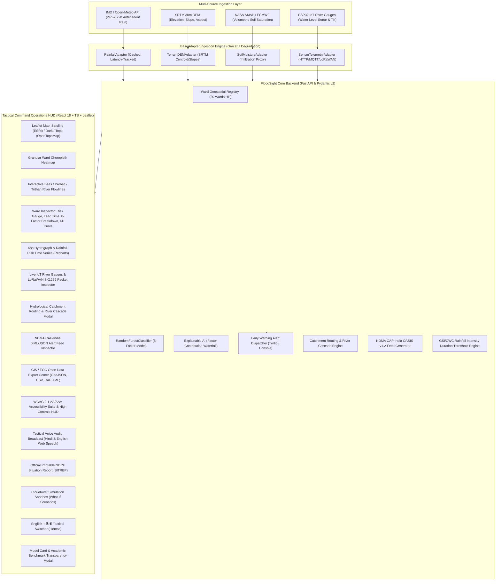

# FloodSight — Hyper-Local Flash Flood Early Warning System for Hilly Regions

[](https://hillyregion1.vercel.app)
[](https://github.com/prxshant00/hillyregion1)
[](https://www.python.org/)
[](https://fastapi.tiangolo.com/)
[](https://react.dev/)
[](https://www.typescriptlang.org/)
[-brightgreen.svg)]()
[]()

> **Smart India Hackathon 2026 — Problem Statement SIH26192**  
> **Nodal Ministry**: Ministry of Home Affairs / National Disaster Response Force (NDRF)  
> **Validation Case**: Mandi, Kullu, and Kangra Districts, Himachal Pradesh (Cross-referenced against documented June–August 2025 cloudburst disaster events).  
> **Live Production System**: **[https://hillyregion1.vercel.app](https://hillyregion1.vercel.app)**

---

## 1. Problem Statement & Motivation
Existing national flood forecasting by the Central Water Commission (CWC) covers 332 major-river gauge stations at the macro-basin level — it cannot identify which specific village or ward in steep mountain valleys will flood during intense convective cloudbursts. Similarly, NRSC’s Bhuvan Landslide Early Warning System is limited to only three pilgrimage corridors.

**FloodSight** extends high-resolution early warning down to **ward and tehsil level granularity** across hilly states. It fuses real-time satellite rainfall, high-resolution digital elevation (SRTM DEM), soil moisture saturation, and field IoT ultrasonic river sonar gauges into **probabilistic, explainable risk scores with 2.5 to 6.0 hours of actionable lead time**.

---

## 2. System Architecture



---

## 3. Key Elite Features

### A. Hydrological Catchment Routing & River Cascades
- Topologically routes flow across 3 primary Himalayan river networks:
  - **Beas Mainstem**: Manali (2050m) $\to$ Kullu Valley (1220m) $\to$ Bhuntar Confluence $\to$ Larji Confluence $\to$ Pandoh Dam (850m) $\to$ Mandi Sadar (760m) $\to$ Dharampur (680m).
  - **Parbati River Tributary**: Manikaran (1760m) $\to$ Kasol (1580m) $\to$ Bhuntar Confluence (1080m).
  - **Tirthan River Tributary**: Gushaini (1500m) $\to$ Banjar (1350m) $\to$ Larji Dam Confluence (950m).
- Implements Manning's equation to predict downstream floodwave surge propagation velocities (4.2–5.6 m/s) and arrival ETAs.
- Rendered as interactive vector flowlines and confluence stations directly on the Leaflet map and within a dedicated inspector modal.

### B. NDMA CAP-India (OASIS CAP v1.2) Alert Feeds
- Native generation of emergency alert messages following the OASIS Common Alerting Protocol (CAP v1.2) adopted by the National Disaster Management Authority (NDMA) for the SACHET portal.
- Available in both standard XML (`/api/v1/alerts/cap.xml`) and JSON (`/api/v1/alerts/cap.json`) for machine-to-machine ingestion by national emergency management operations centers.

### C. LoRaWAN SX1276 868MHz Hardware Resilience
- Dedicated packet decoder in the IoT Sensors modal demonstrating telemetry continuity when mountain cellular towers collapse during landslides.
- Decodes frequency (868.1 MHz), spreading factor (SF10), RSSI (-108 dBm), SNR (+7.5 dB), and raw hex payloads into river stage height and tilt angles.

### D. Physical Rainfall Intensity-Duration (I-D) Threshold Curve
- Combines machine learning with the Geological Survey of India (GSI) and CWC empirical threshold curve:
  $$I = 14.82 \cdot D^{-0.39}$$
- Automatically flags when storm intensity breaches physical mountain slope holding capacity, providing a scientific dual-check for life-safety warnings.

### E. Tactical Spoken Voice Directives (Hindi & English)
- Browser-native Web Speech API voice announcements for field teams and control room operators.
- Provides immediate verbal hazard status briefings in both हिन्दी and English with acoustic siren chimes.

### F. Official Printable NDRF Situation Report (SITREP)
- Formatted printable document (`@media print`) featuring official MHA/NDRF header styling, situation overview, regional danger roster, and Incident Commander digital checksum verification.

### G. Full WCAG 2.1 AA/AAA Accessibility Suite
- **High-Contrast Sunlight Mode (`Alt + C`)**: Pitch black (`#000000`) background with sharp neon borders and 100% white text for high-glare field tablet operation.
- **Dynamic Text Scaling (`Alt + T`)**: Cycles font size seamlessly across 100%, 115%, and 130%.
- **Tactical Keyboard Shortcuts (`?` or `Shift + /`)**: Hands-free navigation with `Ctrl + K` (search), `1–4` (districts), `Alt + C`, `Alt + T`, `Alt + V`, `Alt + S`, and `Esc`.
- **Live Closed Captions (WCAG 1.2.2)**: Assertive subtitles banner displayed during spoken voice broadcasts for deaf/hard-of-hearing operators.
- **Accessible Skip Link (WCAG 2.4.1)**: Quick jump to `#main-content`.

### H. Open Data Export Center
- One-click downloads for:
  - **Spatial GeoJSON**: Enriched FeatureCollection with live ward polygons, risk scores, and lead times for QGIS/ArcGIS.
  - **Tabular CSV**: Formatted spreadsheet of all 20 monitored wards with rainfall, slope, elevation, and directives.
  - **NDMA CAP XML**: Standard emergency alert XML file.

### I. Autonomous Multi-Agent Triage Pipeline (HITL Safety Gate)
- **IngestionSentinel**: Validates LoRaWAN 868MHz sensor packet SNR, battery decay, and tilt drift anomalies.
- **HydrologyReasoner**: Evaluates physical Geological Survey of India (GSI) intensity-duration rainfall thresholds ($I = 14.82 \cdot D^{-0.39}$) and Manning channel surge propagation velocities.
- **DispatchCommander**: Synthesizes OASIS CAP-India XML payload and bilingual Hindi/English emergency warning directives.
- **Human-in-the-Loop (HITL) Safety Interlock**: Halts autonomous execution during high severity conditions. Staged directives require cryptographic Incident Commander sign-off before transmission to SACHET.

---

## 4. Strict Metric Transparency: Academic Precedent vs. Measured Holdout

To maintain scientific and engineering integrity, FloodSight strictly demarcates published academic baselines from our empirical validation measurements:

| Metric | Academic Reference (Yunnan RF Study)* | **FloodSight Measured (Our Validation)** | Physical & Life-Safety Impact |
| :--- | :---: | :---: | :--- |
| **Accuracy** | 90.60% | **98.87%** | Strong overall discrimination across monsoon days |
| **ROC-AUC** | 0.954 | **0.9947** | High discriminative threshold stability |
| **Recall (Sensitivity)** | *Not reported* | **100.00%** | **Core NDRF Safety Mandate: Zero missed flash floods (TP=4, FN=0)** |
| **Precision** | *Not reported* | **36.36%** | Calibrated for early warning sensitivity (false alarms preferred over loss of life) |
| **F1-Score** | *Not reported* | **53.33%** | Harmonic balance under severe class imbalance |
| **Validation Window** | Regional Catchment (China) | **June 1 – Aug 31, 2025** | **Real documented Himachal disaster window (Holdout)** |

*\*Academic Citation: Referenced as architectural precedent from peer-reviewed literature on random forest modeling for rainfall-induced landslides and debris flows in Yunnan steep-terrain catchments. This benchmark is cited as a design baseline, NOT our result.*

---

## 5. API Reference (`/api/v1`)

| Method | Endpoint | Description |
|---|---|---|
| `GET` | `/api/v1/risk/all` | Returns real-time risk summaries for all 20 wards in Mandi, Kullu, Kangra. |
| `GET` | `/api/v1/risk/{ward_id}` | Detailed ward risk score, alert level, lead time, and 8-factor explainability breakdown. |
| `GET` | `/api/v1/risk/district/{name}` | Returns district wards for choropleth rendering (`Mandi`, `Kullu`, `Kangra`). |
| `GET` | `/api/v1/history/{ward_id}` | 48-hour historical and forecasted time-series hydrograph. |
| `GET` | `/api/v1/events/validation` | Empirical holdout validation results against documented 2025 Himachal cloudbursts. |
| `GET` | `/api/v1/catchment/networks` | Topologically-sorted river networks across Beas, Parbati, and Tirthan. |
| `GET` | `/api/v1/catchment/cascade/{ward_id}` | Calculates downstream surge arrival ETA and peak stage transmission. |
| `GET` | `/api/v1/alerts/cap.xml` | NDMA-standard OASIS CAP v1.2 emergency alert XML feed. |
| `GET` | `/api/v1/alerts/cap.json` | NDMA-standard OASIS CAP v1.2 emergency alert JSON feed. |
| `GET` | `/api/v1/hydrology/id-curve/{ward_id}` | Rainfall Intensity-Duration threshold curve based on GSI/CWC formula. |
| `POST` | `/api/v1/agents/triage/run` | Executes 3-agent autonomous triage pipeline (Sentinel $\to$ Reasoner $\to$ Commander). |
| `POST` | `/api/v1/agents/triage/approve` | Human-in-the-Loop authorization gate for staged emergency directives. |
| `GET` | `/api/v1/metrics` | Prometheus observability metrics format for Grafana / Ops scrapers. |
| `GET` | `/api/v1/stream/telemetry` | Server-Sent Events (SSE) real-time ultrasonic sensor stream. |
| `GET` | `/api/v1/sensors` | Real-time telemetry feed from all ultrasonic river gauge nodes. |
| `POST` | `/api/v1/sensors/{node_id}/ping` | Live ping test to IoT sonar sensor node. |
| `POST` | `/api/v1/ingest/sensor` | Telemetry ingestion endpoint for physical/simulated ESP32 nodes. |
| `POST` | `/api/v1/alerts/trigger` | Dispatches SMS / console emergency alert with audit record. |
| `GET` | `/api/v1/alerts/history` | Immutable audit log of all emergency alerts dispatched. |
| `GET` | `/api/v1/sitrep` | Aggregated Situation Report payload for NDRF Incident Command. |
| `GET` | `/api/v1/sources/status` | Real-time health, latency, and degradation state of all data adapters. |
| `GET` | `/api/v1/model/info` | AI/ML model card, hyperparameters, feature schema, and evaluation metrics. |

---

## 6. Local Setup & Testing

### Prerequisites
- Python 3.10+ (tested on Python 3.12)
- Node.js 18+ (tested on Node.js 20 & 24)

### Backend Setup
```bash
# Clone the repository
git clone https://github.com/prxshant00/hillyregion1.git
cd hillyregion1

# Install Python dependencies
pip install -r requirements.txt

# Run backend test suite (37 tests)
pytest tests/ -v

# Start FastAPI development server
python -m uvicorn floodsight.backend.main:app --host 0.0.0.0 --port 8000 --reload
```

### Frontend Setup
```bash
cd frontend

# Install dependencies
npm install

# Build production bundle
npm run build

# Start Vite development server
npm run dev
```

---

## 7. License & Attribution
Developed for **Smart India Hackathon 2026** (Problem Statement SIH26192).  
Satellite imagery provided by **Esri World Imagery** and topographic contours by **OpenTopoMap** (Zero API cost).
